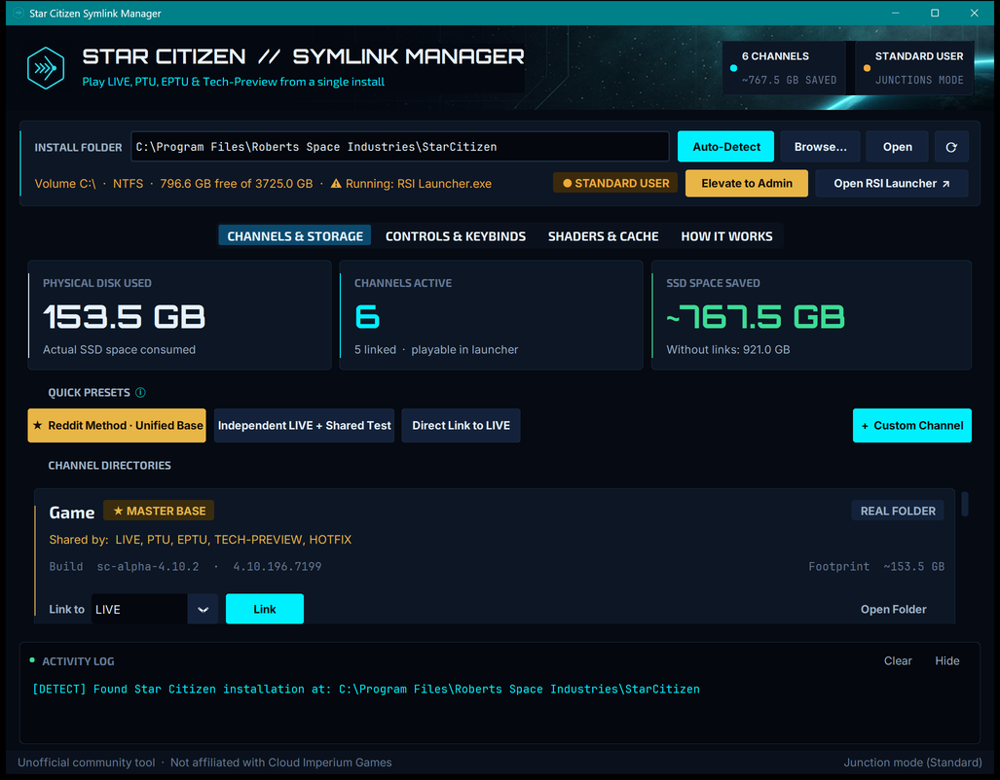

# Star Citizen Symlink Manager 🚀
### Multi-Environment Storage Saver & Delta Patcher Companion

<p align="center">
  
</p>

A modern desktop application built for **Star Citizen** backers to install and play multiple release channels (**LIVE**, **PTU**, **EPTU**, **TECH-PREVIEW**, **HOTFIX**, **4.0_PREVIEW**) using the disk space of only a single installation.

Inspired by the community guide on [r/starcitizen](https://www.reddit.com/r/starcitizen/comments/17lt803/howto_use_symbolic_links_to_install_multiple/).

---

## ⚡ The Problem & The Solution

- **The Problem**: Star Citizen installations are ~100GB to 150GB+ each. If you install LIVE, PTU, EPTU, and TECH-PREVIEW simultaneously, it eats **400GB to 600GB+** of prime NVMe SSD storage.
- **The Solution**: 90% to 95% of Star Citizen's game data (`Data.p4k`, texture packs, sound archives) is identical between channels. By using **Windows Symbolic Links** or **NTFS Junctions**, all channels share the same physical files while the RSI Launcher treats each channel as an independent directory with its own path!

When switching between channels in the RSI Launcher, clicking **"Verify Files"** downloads only the small delta update (typically 2GB–8GB) instead of 150GB.

---

## 🌟 Key Features

1. **Auto-Detection**:
   - Automatically locates your Star Citizen installation by parsing RSI Launcher logs, registry keys, and common drive paths.
   - Verifies drive filesystem (NTFS / ReFS) and free SSD capacity.

2. **1-Click Presets**:
   - ⭐ **The Reddit Method (Unified Base)**: Establishes a master `Game` folder and symlinks `LIVE`, `PTU`, `EPTU`, `TECH-PREVIEW`, and `HOTFIX` to it. Maximum space savings!
   - ⚡ **Independent LIVE + Shared Testbed**: Keeps `LIVE` as a real, untouched directory (always ready for live org raids without re-downloading) while linking `PTU`, `EPTU`, and `TECH-PREVIEW` together.
   - 🔗 **Direct Link to LIVE**: Uses `LIVE` as the master folder and links all test channels directly to it.
   - ➕ **Custom Channel Support**: Add event channels such as `4.0_PREVIEW`, `HOTFIX_TEST`, etc.

3. **🎮 HOTAS, HOSAS & Keybinding Protection**:
   - Never lose your joystick curves, throttle mappings, `actionmaps.xml`, or custom character presets (`.chf`).
   - 1-Click timestamped backups saved directly to ZIP archives.
   - 1-Click restore into any channel.

4. **🧹 Shader & USER Cache Cleaner**:
   - Scans `%LOCALAPPDATA%\Star Citizen` for bloated versioned shader caches.
   - One-click cleaning of old shaders (the #1 fix for graphic glitches and game crashes when switching versions).
   - **Safe USER Cache Purge**: Follows CIG's official recommendation to wipe temporary caches while strictly preserving custom controls.

5. **🛡️ Safety First**:
   - **Safe Unlinking**: Never deletes game files inside target directories when removing a link.
   - **Process Guard**: Detects if `StarCitizen.exe` or `RSI Launcher.exe` is running to prevent file locking.
   - **UAC Elevation Helper**: Supports both native Symbolic Links (Admin/Developer Mode) and NTFS Directory Junctions (no admin privileges needed).

6. **💡 Built-in Tooltips & Guidance**:
   - Interactive mobiGlas hover tooltips across every badge, button, and preset to explain what each function does, how files are affected, and when to use them.

7. **🎨 Star Citizen mobiGlas HUD Theme & Official Fankit Support**:
   - Sci-fi aesthetic with clean status indicators and bundled *Electrolize* display font.
   - **Official Asset Drop-in**: Backers can drop official assets from the [RSI Fankit](https://robertsspaceindustries.com/fankit) into `assets/fankit/` (`logo.png`, `header.png`/`header.jpg`, `made_by_the_community.png`) and the app automatically integrates them on next launch.

---

## 🖥️ How to Run

### Option 1: Standalone Windows Executable (No Python needed)
Simply navigate to:
```
dist\StarCitizen-Symlink-Manager\StarCitizen-Symlink-Manager.exe
```
and double-click to launch!

### Option 2: Double-Click Batch Launcher
Double-click `run.bat` in the project root.

### Option 3: Python Command Line
```bash
# Install dependencies
pip install -r requirements.txt

# Launch modern CustomTkinter GUI
python main.py

# Check channel status and storage savings via CLI
python main.py --status

# Apply Reddit Unified Base preset via CLI
python main.py --preset reddit

# 1-Click Backup Controls via CLI
python main.py --backup-controls

# Clean old shader caches via CLI
python main.py --clean-shaders --keep-latest-shaders
```

---

## 🕹️ How to Play After Setting Up Links

1. Open **RSI Launcher**.
2. Select the channel you want to test (e.g. **EPTU** or **PTU**).
3. Click **"Verify Files"** (or Update). The launcher will do a quick delta scan and download only changed files.
4. Click **"Launch Game"**!
5. When switching back to another channel (e.g. **LIVE**), select it in the launcher and click **"Verify Files"**.

---

## 📂 Project Architecture

```
StarCitizen-Symlink-Manager/
├── assets/
│   ├── fankit/          # Optional drop-in folder for official RSI Fankit logos/headers
│   ├── fonts/           # Bundled fonts (Electrolize display typeface)
│   └── ui/              # Bundled app iconography, emblem, and header banner art
├── src/
│   ├── core/
│   │   ├── detector.py      # Auto-detection of SC installs, logs, registry, drives
│   │   ├── symlink_ops.py   # Safe symlink/junction creation, unlinking, Win32 reparse tags
│   │   ├── channel_mgr.py   # Channel status discovery, manifest parser, preset application
│   │   ├── keybind_mgr.py   # Backup & restore controls/mappings, USER directory management
│   │   ├── shader_mgr.py    # Safe shader cache and USER cache cleaning (preserving controls)
│   │   └── process_guard.py # Detects running StarCitizen.exe or RSI Launcher.exe
│   └── gui/
│       ├── app.py           # Main CustomTkinter window with mobiGlas HUD aesthetic
│       ├── components.py    # Metric cards, channel cards, collapsible activity log
│       ├── tooltip.py       # Non-flickering hover tooltip widget with mobiGlas styling
│       ├── help_text.py     # Centralized explanation copy for every control and badge
│       ├── assets.py        # Font loader & asset resolver with Fankit auto-detection
│       └── theme.py         # SC color palette, semantic statuses & typography
├── backups/                 # Timestamped ZIP backups of keybindings and controls
├── tests/
│   └── test_core.py         # Automated test suite
├── main.py                  # Entry point (GUI + CLI)
├── run.bat                  # Double-clickable launcher
├── build_exe.bat            # Script to rebuild standalone .exe
└── README.md
```

---

## 🤝 Requirements
- Windows 10 / Windows 11 (64-bit)
- NTFS or ReFS formatted drive (Standard for Windows installations)
- Python 3.10+ (only if running from source; not required for `.exe`)
